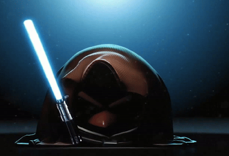

### Authors 
- Ayesha Binte Mostofa (1805062)
- Md. Sayeed Hasan Ovi (1805065)
- Akibur Rahman (1805086)

### Supervisor
 - Md. Saiful Islam, Assistant Professor, CSE, BUET
---
# I_ANGRY_BIRD

  

I_ANGRY_BIRD is an exciting and creative game inspired by the famous Angry Birds, developed by three enthusiastic CSE undergraduate students, made for Level-1 Term-1 Term Project.

### Description
The nomenclature of this game is such because it is made using a predefined header file named IGRAPHICS and it is inspired by Angry Bird game. The game has 3 subsequent levels . the main storyline of the game is the pig at first steal the egg of the birds and the birds become very angry. They went on hunting the pigs and the pigs take shelter under their so called construction. The aim of the game is to destroy the construction of the pigs and recover the egg from the pigs. The gamer will play as an angry bird and and when he clear the last stage then and only then he is the winner.The high score will done only when the gamer can complete the full game playing in a single span. That is the high score will not be valid if gamer fails at any level.

---

  

### Code Structure

#### Highscore
- Updates the high score at the end of the game if the player's score qualifies.

#### Startupdate
- Updates the loading bar on the starting screen.
- Utilizes a timer that pauses once loading is complete.

#### Startdotupdate
- Displays additional elements on the starting screen.
- Self-paused function similar to Startupdate.

#### Menumusic
- Plays music when the game starts.

#### Mapp
- Indicates the power with which the bird is released.
- Tracks speed based on keyboard inputs.

#### Projectile
- Core gameplay function handling:
  - Bird release from the slingshot.
  - Bird trajectory using a parabolic equation.
  - Collision detection.
  - Tracking and removing obstacles.
  - Score updates.
  - Level progression or game over conditions.

#### Backgrounddraw
- Handles main menu background animation using 1400-1500 BMP files.

#### Idraw
- Predefined IGRAPHICS function for displaying content on the graphics console.
- Shows different screens based on the `consol` variable.

#### Imouse
- Predefined IGRAPHICS function for mouse control.
- Changes screens based on button clicks.

#### Ikeyboard
- Predefined function for keyboard control.
- Game played using the space button.

#### Ispecialkeyboard
- Handles arrow key inputs for aiming.
- Predefined IGRAPHICS function.

#### main
- Contains all initialization codes for starting the game.

##### Additional Notes
- Due to the substantial number of BMP files required for the animation, these files have not been included in the GitHub repository. To provide a demonstration, two GIFs above have been added as examples.
- Move everything from "Assets" Folder to "../Assets" (Where the code "iGraphics" is) Folder to run the code without error. 
